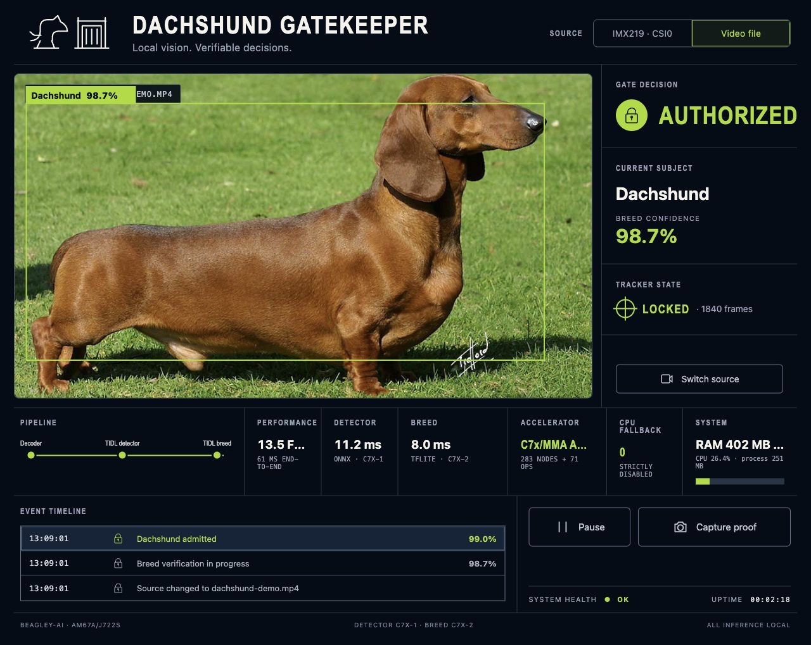

# BeagleY-AI EdgeAI demos

Hardware-validated, locally accelerated demos for the 4 GB BeagleY-AI
(TI AM67A/J722S). The accompanying release installs the matching TI EdgeAI
11.02 stack on 64-bit Armbian Ubuntu Noble without requiring TI's prebuilt
filesystem image.



## Demos

| Demo | Accelerator path |
| --- | --- |
| [TFLite image classification](demos/tidl-tflite-image-classification/) | MobileNetV1, 34/34 operators in one TIDL group |
| [TFLite dog-breed classification](demos/tidl-tflite-dog-breed-classification/) | MobileNetV2, 71/71 operators in one TIDL group |
| [Dachshund Gatekeeper](demos/dachshund-gatekeeper/) | YOLOX on C7x-1, TFLite breed classifier on C7x-2, uploaded/existing video or IMX219 CSI0 through VPAC ISP |

Every demo fails closed when its expected TIDL graph is missing. Recorded
proofs include execution time, memory, C7x DDR counters, model hashes, and CPU
fallback state; a result that silently ran only on Cortex-A is not accepted.

## Install on normal Armbian

The release asset is an ordinary `tar.xz` archive containing:

- 28 validated `arm64`/`all` EdgeAI Debian packages;
- the matching Armbian `6.12.49-vendor-k3-beagle` kernel and DTB packages;
- apt metadata, package manifests, checksums, and the guarded installer.

For a BeagleY-AI running 64-bit Armbian Ubuntu Noble:

```bash
TAG=v11.2.1-beagley.1
BASE="https://github.com/TexasInstruments-Sandbox/BeagleY-EdgeAI-Demos/releases/download/${TAG}"
ASSET="beagley-edgeai-all-debs-j722s-psdk-11.02.01.03.tar.xz"

curl -fLO "${BASE}/${ASSET}"
curl -fLO "${BASE}/SHA256SUMS"
sha256sum -c SHA256SUMS
tar -xJf "${ASSET}"
cd beagley-edgeai-j722s-psdk-11.02.01.03

# No camera:
sudo ./install-j722s-release.sh \
  --debs debs --kernel kernel --camera none --reboot

# Or replace `none` with `imx219` for an IMX219 attached to CSI0.
```

Read [the complete Armbian installation and rollback guide](docs/STOCK_ARMBIAN_INSTALL.md)
before installing. The installer is board-, architecture-, userspace-,
firmware-, and kernel-aware; it verifies every checksum and records the prior
package and boot state under `/var/lib/ti-edgeai-release/`.

After reboot, run the strict stack smoke test:

```bash
sudo validate-j722s-edgeai
```

Start the Gatekeeper and open `http://BOARD-IP:8088/`:

```bash
sudo systemctl enable --now ti-edgeai-dachshund-gatekeeper
curl -fsS http://127.0.0.1:8088/api/status | python3 -m json.tool
```

The service starts with its bundled Dachshund video, so both C7x pipelines can
be tested before a camera is attached.

## Versions

- TI Processor SDK: `11.02.01.03` (`11.2.1`)
- PSDK Analytics: `REL.PSDK.ANALYTICS.11.02.01.02`
- TIDL tools and OSRT: `11.02.16.00`
- Vision Apps: `11.02.03`
- Kernel ABI: `6.12.49-vendor-k3-beagle`
- Userspace: Ubuntu Noble, `arm64`

The reproducible package and firmware sources live in
[TexasInstruments-Sandbox/ti-edgeai-armbian-build](https://github.com/TexasInstruments-Sandbox/ti-edgeai-armbian-build).
This repository is the smaller, user-facing home for demos, proofs, install
instructions, and release downloads.

## Licensing

Demo code is BSD-3-Clause. Some bundled models and media use compatible or
share-alike third-party licenses; see [THIRD_PARTY.md](THIRD_PARTY.md).
