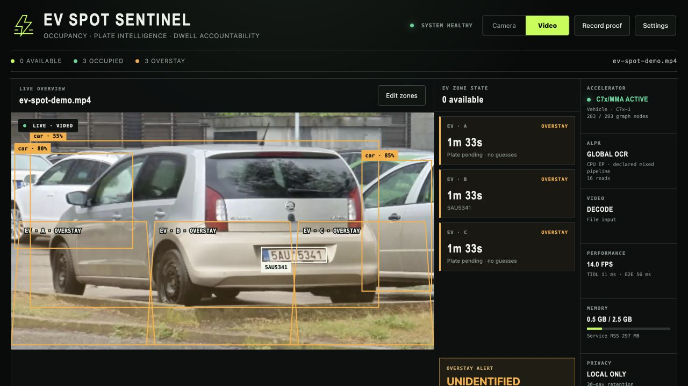

# EV Spot Sentinel

EV Spot Sentinel is a local-first parking demo for the 4 GB BeagleY-AI. It
combines accelerated vehicle occupancy, license-plate reading, per-spot dwell
timers, overstay alerts, and a longest-stay leaderboard in one browser UI.



The screenshot is from the real board. The bundled parking clip ran at 14 FPS,
with all 283 vehicle-detector graph nodes on `TIDLExecutionProvider`/C7x-1 and
CPU fallback disabled. Plate `5AU5341` was read by the separately attributed
global ALPR path. The [machine-readable proof](proof/ev-spot-accelerated-proof.json)
and [annotated frame](proof/ev-spot-accelerated-proof.jpg) are captured by the
same service.

## What is accelerated

- Vehicle localization: TI's J722S-compiled
  `ONR-OD-8200-yolox-nano-lite-mmdet-coco-416x416`; one 283-node TIDL graph on
  C7x/MMA core 1. ONNX Runtime CPU fallback is disabled.
- IMX219 camera: CSI0 Bayer capture through `tiovxisp` and VPAC VISS, producing
  NV12 before conversion for inference and display.
- Plate detector and global OCR: pinned ONNX models on Cortex-A CPU. The PSDK
  11.02 compiler fragmented these graphs into 11 and 16 subgraphs, so this
  release does not present them as accelerated. ALPR runs asynchronously with
  a bounded queue and exponential retry backoff so it does not stall TIDL.

An occupied spot without a stable plate remains `UNIDENTIFIED`; the service
never invents a plate to fill a leaderboard row.

## Install and run

Install the complete J722S release using the repository's
[one-line installer](../../README.md#quick-install--copy-and-paste). The demo
package is included in the release and is installed disabled:

```bash
sudo systemctl enable --now ti-edgeai-ev-spot-sentinel
curl -fsS http://127.0.0.1:8090/api/status | python3 -m json.tool
```

Open `http://BOARD-IP:8090/`. The service starts with a bundled parking video,
so no camera is required. Use **Source** to select an existing board video,
upload a video, or switch to `IMX219 · CSI0`. Starting Sentinel stops the
Gatekeeper or OmniCode service because the demos share exclusive TIDL/TIOVX
resources.

Installation leaves the unit disabled and inactive. Upgrades preserve the
conffile and enabled policy; a service that was active is restarted with the
new payload, while a dormant service remains dormant.

To boot directly into camera mode, edit the preserved conffile:

```bash
sudo sed -i 's/--source video.*/--source camera"/' \
  /etc/default/ti-edgeai-ev-spot-sentinel
sudo systemctl restart ti-edgeai-ev-spot-sentinel
```

The IMX219 must be attached to CSI0 and the stock-install helper must have been
run with `--camera imx219`. The camera pipeline is 1920x1080 SRGGB8 through the
J722S IMX219 VISS/2A DCC data. No SD UHS-mode changes are needed or made.

## Calibrate parking zones

Select **Edit zones**, drag each polygon's four control points over a parking
space, and save. Coordinates are normalized, so they continue to align when
the browser resizes. Saving zones intentionally ends active sessions before
tracking resumes; it never silently carries dwell time across a changed zone.

The default overstay threshold is 30 minutes. Change service policy by adding
arguments to `SENTINEL_ARGS`, for example:

```bash
SENTINEL_ARGS="--source video --video /srv/parking.mp4 --overstay-seconds 3600 --retention-days 14"
```

State, uploaded media, proof captures, `spots.json`, and `sessions.sqlite3`
live under `/var/lib/ti-edgeai-ev-spot-sentinel`. SQLite uses a rollback journal
and full synchronization, which is safe for the validated NFSv4.2 root; WAL is
deliberately not used.

## Validate acceleration

```bash
status=$(mktemp)
curl -fsS http://127.0.0.1:8090/api/status >"$status"
jq '{source, performance, acceleration, memory, system, spots}' "$status"

# Must report 283 nodes, CPU fallback false, and increasing invocations.
jq -e '.acceleration.active == true and
       .acceleration.vehicle.provider == "TIDLExecutionProvider" and
       .acceleration.vehicle.nodes == 283 and
       .acceleration.vehicle.cpu_fallback == false' "$status"

# Capture an annotated JPEG plus matching JSON evidence.
curl -fsS -X POST -H 'Content-Type: application/json' \
  -d '{"action":"capture"}' http://127.0.0.1:8090/api/control | jq
```

For camera validation, `.source.isp_active` and `.acceleration.isp.active`
must both be true while `.performance.frames` continues increasing.

## Roll back

```bash
sudo systemctl disable --now ti-edgeai-ev-spot-sentinel
sudo apt remove ti-edgeai-ev-spot-sentinel  # preserves config and session/proof data
sudo apt purge ti-edgeai-ev-spot-sentinel   # also removes its /var/lib state
```

The package owns only its named `/usr`, `/etc/default`, systemd, and
`/var/lib` paths. Removal does not touch the shared EdgeAI runtime or another
demo's data.

## Build or develop

The reproducible build lives in
[`ti-edgeai-armbian-build`](https://github.com/TexasInstruments-Sandbox/ti-edgeai-armbian-build/tree/agent/j722s-omnicode-demo/packages/edgeai/ti-edgeai-ev-spot-sentinel).
It checksum-verifies both MIT-licensed ALPR models, reuses the strictly compiled
TI vehicle model, builds the lockfile-pinned UI, and produces an ARM64 Debian
package:

```bash
packages/edgeai/ti-edgeai-ev-spot-sentinel/build-from-source.sh
```

Build the UI alone with `npm ci && npm run build` in `ui/`. For a direct board
run, use `sudo ./sentinel.py --ui-dir ui/dist` and supply the model paths shown
by `./sentinel.py --help`.

## Privacy and appropriate use

Sentinel binds locally and performs no cloud calls. Plates and dwell history
are personal data in many jurisdictions: post notice where required, choose a
short retention period, restrict dashboard and state-directory access, and
obtain any necessary authorization. This is a demonstration and review tool,
not an automated enforcement system. Every overstay decision requires human
review.

## Model and media provenance

- Vehicle detector: TI EdgeAI model-zoo entry named above, compiled for J722S
  with TIDL tools 11.02.16.00.
- Plate detector: `open-image-models` asset
  `yolo-v9-t-384-license-plates-end2end.onnx`, SHA-256
  `888397b96d761c89db40bc9c305838e8652660f5e282c2cadebbe8d2951a77a8`.
- OCR: `fast-plate-ocr` global `cct_xs_v2` model, SHA-256
  `8031afb5fdc6b4d80462c9d542f1284ebd2cfddf5dbacd62609848d7e2855f44`.
- Bundled parking image/video: derived from the FastALPR MIT-licensed test
  fixture at revision `aca4ecdd279350ffdda8dffb0badd70952470c28`.

The ALPR projects and fixture are MIT licensed; package copyright metadata
records exact revisions and URLs.
